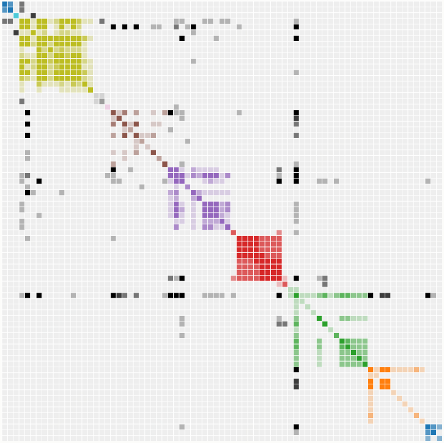

作者：李军利	AI-Friend    /  5th Dec. 2020

内容：deepwalk 和 node2vec 的总结思考；网络同质性和结构性的探索

[TOC]

通常来说，<u>图神经网络</u> 分成 Graph Embedding (`基于游走`) 和 Graph CNN (`基于邻居汇聚`) 两类。

Graph Embedding 算法用低维稠密的向量表示点或边，期望图中的相似 ( `不同的方法对相似的定义不同 `) 顶点在低维空间的表示也接近。旨在训练顶点或边的连续特征表示，用于下游的机器学习任务，如节点分类，链接预测等。[deepwalk](#deepwalk) 和 [node2vec](#node2vec) 是经典的游走类 Graph Embedding 算法，核心步骤是 **截断(随机)游走** 和 **顶点表示** :
$$
truncated \ (random/weight/BFS/DFS)\ walk + word2vec(skip\ gram)
$$
**truncated random walk** 就是在 Graph 上随机游走，设定游走长度，采样像句子一样的序列；然后word2vec训练顶点的表示。embedding、word2vec 的内容可参考 [AI-Friend: Deep-Learning](https://github.com/AI-Friend/Deep-Learning) 的相关文章。

**经典游走类算法的假设：**基于 `邻域相似性假设`，即相邻的顶点更相似。

*Yoshua Bengio 等人在 DGI 中指出了游走类算法的两个缺点（过分强调其他论文的缺点是常规操作了:smile:）：*

* 模型强依赖调参，改变超参，模型效果差异大
* 随机游走类算法假设 相邻顶点大概率有相同label，以图的结构性信息为代价，过分强调顶点之间的近邻性

DGI 是以 `互信息` 为基础的无监督算法，考虑局部和全局信息，相关内容可参考 [README](https://github.com/AI-Friend/Graph-Algorithms/blob/master/README.md) 表格里的DGI链接。

# deepwalk

DeepWalk 算法流程（EGES论文[6]）

$deep walk = weighted\ walk + skip\ gram$ ，weighted walk 是一种可重复访问已访问顶点的带权DFS算法。

deep walk 可提取任务无关的特征，经常作为 baseline，尤其适用于信息缺失，标签少，数据量小的情况。

> 经验思考

* deepwalk 适用于 `homogeneous graph`，但实际使用时，无需拘泥于是否同构图，也可尝试 `heterogeneous graph`，若希望 graph 中的路径权重不同，或者想要 加强/丢弃某些 有/无意义的路径，采样时，可指定顶点/边类型，或者尝试 [metapath2vec](https://github.com/AI-Friend/Graph-Algorithms/blob/master/README.md)
* 如果使用带权游走（ weighted walk）,  [Alias method](https://github.com/AI-Friend/Graph-Algorithms/blob/master/README.md) 提前构建采样器，时间复杂度O(1)
* 输出训练好的embedding，当增量数据加入时，重新构建模型，用训练好的向量初始化embedding的历史空间。如果希望简化步骤，节省时间，建议第一次初始化向量空间时，就给予一个相对大的 max id, 这样新加入的顶点就可以用之前没用过的空间，但预留的空间也不能太大，否则会造成空间的浪费，适合增量数据不多的情况，采样时可以指定只采增量顶点*（空间换时间）*
* target encoder(目标顶点的embedding空间) 和 context encoder（邻居与负样本的embedding空间）可共同一个向量空间，也可用不同的向量空间，历史经验来看，用不同的embedding空间效果可能会更好，相同的embedding空间则可以显著加快收敛速度，节省内存，更适合稀疏图
* 分布式训练时（数据并行），机器性能相近优先考虑同步模式，机器性能差异大时，优先考虑异步训练模式。tensorflow分布式训练 deep walk，有时候会出现loss异常大的情况，非chief节点的checkpoint_dir 指定为None 可避免，监督模型的分布式没有这个问题
* 经典deep walk的顶点是没有属性的，实际使用时，带属性效果会更好，相当于加入了额外信息
* **random walk** 不适用于社交和商品等网络，因为这类网络的中大部分顶点的关联性很弱，**热点顶点** 的重要性很高（与文本中的热点词相反，文本的热点词并不居于重要地位，比如 “这样”，“哪里”......）。random walk 会采出很多冷门顶点的序列，适合在文本中采序列，而 `weighted walk`（基于边的权重采样）可以尽量往`热门顶点`方向游走，采出来的样本序列置信度更高

# node2vec

node2vec 是一种综合考虑 DFS 邻域和 BFS 邻域 的 graph embedding方法。在带权的 graph 上控制游走策略（倾向BFS或者DFS），达到同质性(homophily)与结构性(structural equivalence)的平衡。

 node2vec walk 

$u$ 与 $S_6$ 的结构相似，是两个热点/中心顶点；$u$ 或 $S_6$ 和它们的邻居更可能属于同一性质的顶点（近邻假设）

结构性有些玄学，下一节继续深入探讨

 node2vec 笔记 
字太丑了

# 研究同质性与结构性

网络的同质性和结构性是什么?  BFS和DFS 哪一个擅长刻画同质性，哪一个擅长刻画结构性？没有统一的解释标准，node2vec 的作者也没有清晰的说明。论文中的结构性确实有意义，有效果，但是我觉得实际场景中的数据很难达到有论文中的效果，只有合适的数据集和超参数，才能达到惊艳的效果*（什么样的数据是比较合适呢？）*。

使用word2vec训练的前提下，无论BFS/DFS或者其它策略，都必须通过序列表达出它们的不同。不同的游走方式产生不同的序列，导致上下文的差异，进而影响了最终的embedding体现出来的性质。无论采样什么游走策略，同一个序列，同一个窗口里的顶点的embedding更相似，这是word2vec方法决定的。不能被很多文章中看似合理的，说的通的解释扰乱，远离了本质。读完下文，相信很容易分别出图中上下部分哪个是BFS/DFS策略。

*二维空间常常有误导性，多维空间里最左边和最右边的顶点的实际距离可能没有二维图中显示的那么大*

 node2vec BFS和DFS策略对比

**同质性**比较容易理解，字面意思是具有相同性质的顶点的embedding比较相似，在图上，一般认为距离越近的顶点，性质越相同。另外，同质性更像是宏观上的性质，要求模型能够找出 **每个簇的边界**（社区/聚类），使得簇内顶点距离更近，簇外顶点距离更远，这要求模型有更大的感受野，**DFS** 能跳出局部的方式就适合这个要求。

**结构性**字面意思是具有相同结构的顶点的embedding比较相似，在图上，中心顶点和中心顶点，边缘顶点和边缘顶点的结构可能比较相似。另外，结构性更像是微观意义上的结构，要求模型能能够充分学习微观（低阶邻居）上的局部结构。比如，三角形的局部结构，BFS策略会重复采三角形上的顶点，加强对这个三角形的感知，而 DFS 则容易通过连向外界的边跳出去，所以 BFS 对局部结构（低阶邻居）学习的更好。

如果侧重DFS游走，即使两个顶点不相连，只要它们有<u>共同的低阶邻居</u>（2阶/3阶），也会得到相似的序列（上下文），训练后的embedding也会比较相似，可以更好地找到簇/社区的边界，适合挖掘网络的同质性，适合聚类。如果侧重于BFS，由于微观/局部结构内的顶点的上下文会有更多的重叠，它们的的embedding会更加相似，适合挖掘网络的结构性，因此BFS可以更好地感知顶点所处的局部结构。

BFS策略：微观/局部/低阶邻居的顶点很相似；中心顶点可能比较相似；三跳以上的邻居很可能不相似

DFS策略：宏观/全局意义上，多阶邻居的顶点相似，可以聚类成很多社区；中心顶点属于不同的社区，并不相似

> 什么样的数据是比较容易推理结构性的呢？

**BFS 策略可对比 [LINE](https://github.com/AI-Friend/Graph-Algorithms/blob/master/README.md) 的二阶相似性，以及二阶相似性适用的图结构。**

相似的序列/上下文是embedding相似的根本原因。如果两个顶点 $a,b$  结构相似，期望它们的embedding相似，最简单的途径就是 $a,b$  出现在同一个序列的窗口内；或者它们的上下文比较相似（有共同的低阶邻居，类似文本中的“的”和“地”），这两个条件不冲突。 $a,b$  本身是不相连的，它们只能通过共同的低阶邻居（BFS游走的前提下,不超过2阶）达到这两个条件：`出现在同一个序列中；或者共同的邻居出现在各自的序列中。BFS使得后者更容易达到`。

参考 [node2vec walk](#node2vec) 图，作者放这个图的本意可能只是展示BFS和DFS游走的区别，但是仅仅用这个图是不能很好的表示出 $u$ 和 $s_6$ 的结构性的（仅就这个图而言，侧重BFS的话 $u$ 和 $s_6$ 只会更它们的1阶邻居更相似，DFS反而可能将整个图训练成一个社区），甚至有误导性。侧重BFS时， $u$ 和 $s_6$ 一定还有其它很多共同的属于不同社区的低阶邻居，BFS注定了邻居的低阶性，如果低阶邻居都在一个社区，那么 $u$ 和 $s_6$ 也会和这些邻居都相似。因此，就像文本序列 “的” 和 “地”一样， $u$ 和 $s_6$ 不仅上下文相似，而且上下文丰富多彩，语义不同（与文本中不一样的是，这些中心顶点是非常重要的）。类似地，边缘顶点要体现结构性，边缘顶点类似于句子序列中的 “吗” 和 “呢” ，经常处于句子开头后者结尾，并且有相似的丰富的上下文。

node2vec使用的是 <悲惨世界> 人物关系图，连接不同社交圈的中心人物/边缘人物 符合这种要求。对照邻接矩阵图，对角线上相同颜色人物属于同一个社交圈，从横轴来看，那些连接多个社区黑色顶点，他们的结构相似，同时与多个社区相连，在BFS游走中，更可能出现在同一个序列或者相似的上下文序列里。

Les Miserables adj

后续：训练一些特别的图数据，可视化后，看是不是能够进一步佐证本文的一些想法 参考 [复盘node2vec](https://github.com/AI-Friend/Graph-Algorithms/blob/master/README.md)

> 应用场景

类似precision和recall，同质性与结构性通常是不可兼得的，同质性偏向宏观/高阶/全局，结构性偏向微观/低阶/局部。node2vec 体现的网络的同质性和结构性在推荐系统中比较容易解释，同质性相同的物品很可能是同品类、同属性、或者经常被一同购买的物品，而结构性相同的物品则是各品类的爆款、各品类的最佳凑单商品等拥有类似趋势或者结构性属性的物品。毫无疑问，二者在推荐系统中都是非常重要的特征表达。由于node2vec 的这种灵活性，以及发掘不同特征的能力，甚至可以把不同 node2vec 生成的embedding融合共同输入后续深度学习网络，以保留物品的不同特征信息。

大部分情况下，图上距离能代表实际距离时，DFS是首选，比如DFS可以保证推荐系统要求的发现性。用户行为是一个天然的网络图，边和节点往往有着各种丰富的信息，graph embedding学习节点隐表示向量，在一个连续向量空间中对节点的关联关系进行编码，便于计算节点之间的关联关系，同时，graph具有传播能力，通过random walk可以挖掘多度关系，能有效的提升覆盖度，扩大召回。

如果想关注爆点，比如爆款/百搭商品、**最佳凑单商品**、风控网络中危害大的黑顶点、社交网络中的活跃顶点，交通网络中的非常堵的十字路口等，可以考虑BFS，有可能会取得更好的效果。如果只关注二阶之内的相似性，BFS也是更好的选择。

边缘点暂时没接触到具体的应用场景，跟冷启动商品好像也不那么相关。

# REFERENCES

[1] [deepwalk: Online Learning of Social Representations](https://arxiv.org/pdf/1403.6652.pdf) 

[2] [node2vec: Scalable Feature Learning for Networks](https://cs.stanford.edu/people/jure/pubs/node2vec-kdd16.pdf) 

[3] [deepwalk-master](https://github.com/phanein/deepwalk)

[4] [node2vec-master](https://github.com/aditya-grover/node2vec)

[5] [王喆: Graph Embedding ](http://blog.itpub.net/29829936/viewspace-2644276/)

[6] [Enhanced Graph Embedding with Side Information](https://arxiv.org/abs/1803.02349)

[7] [AI-Friend: Deep-Learning](https://github.com/AI-Friend/Deep-Learning)